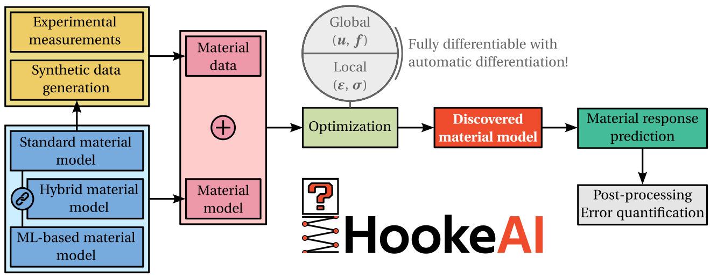

HookeAI
=======

|

Summary
-------
**HookeAI** is an open-source Python package built on `PyTorch <https://pytorch.org/>`_ to perform material model updating at the intersection of **computational mechanics**, **machine learning** and **scientific computing**. At its core lies the `Automatically Differentiable Model Updating (ADiMU) <https://arxiv.org/abs/2505.07801>`_ framework, which enables **finding general history-dependent material models** - conventional (physics-based), neural network (data-driven), or hybrid - from different data sources (e.g., strain-stress data, displacement-force data). It also includes numerous computational resources to support **material modeling research**, namely data generation methods, highly-customizable material model architectures, and data analysis and visualization tools.

.. image:: ../media/schematics/adimu_global_discovery.png
   :width: 70 %
   :align: center

|

----

Statement of Need
-----------------
In an era where a multidisciplinary approach is increasingly essential for scientific and technological progress, **HookeAI** is a computational platform aiming to integrate three key domains: (1) **computational solid mechanics**, accounting for decades of well-grounded physics-based material modeling, (2) **machine learning**, where deep learning architectures are capable of learning complex material behavior from data, and (3) **scientific computing software**, leveraging modern automatic differentiation, optimization techniques and GPU vectorization to efficiently solve challenging inverse problems. By combining these three pillars in a unique highly-customizable and well-documented software platform, HookeAI addresses the needs and challenges in teaching, research and industry, where **accurate material modeling** is crucial for the design and analysis of engineering systems.

In a **teaching environment**, HookeAI extensive documentation, pre-built material models, user-friendly interfaces, and data visualization tools make it an excellent resource for advanced courses in computational solid mechanics with machine learning, namely to enable hands-on learning and experience. In a **research setting**, HookeAI provides a comprehensive end-to-end platform for developing and testing new material model architectures, setting up reproducible benchmarks, comparing the performance of optimization algorithms, conducting rigorous analyses of material data sets, and much more. Its extensive out-of-the-box functionalities, combined with a modular and highly-customizable design, greatly reduce the time and effort needed to implement new ideas, allowing researchers to focus on scientific innovation. In an **industrial context**, HookeAI enables the discovery of a wide range of material models from numerical or experimental data, providing practical solutions to real-world material modeling challenges. Applications include designing novel material systems with disruptive properties, tailoring material performance for specific uses, improving the accuracy of product design and analysis simulations, supporting multi-objective topology optimization, and beyond.

Consider **leaving a star** if you think HookeAI is useful for the community!

|

----

Authorship & Citation
---------------------

HookeAI was originally developed by Bernardo P. Ferreira [#]_.

.. [#] `LinkedIn <https://www.linkedin.com/in/bpferreira/>`_ , `ORCID <https://orcid.org/0000-0001-5956-3877>`_, `ResearchGate <https://www.researchgate.net/profile/Bernardo-Ferreira-11?ev=hdr_xprf>`_

If you use HookeAI in your research or in a scientific publication, please cite:

**Journal of the Mechanics and Physics of Solids** (`paper <https://www.sciencedirect.com/science/article/pii/S0022509625003825?via%3Dihub>`_):

.. code-block:: python

    @article{ferreira2025a,
      title = {Automatically Differentiable Model Updating (ADiMU): Conventional, hybrid, and neural network material model discovery including history-dependency},
      journal = {Journal of the Mechanics and Physics of Solids},
      pages = {106408},
      year = {2025},
      issn = {0022-5096},
      doi = {https://doi.org/10.1016/j.jmps.2025.106408},
      url = {https://www.sciencedirect.com/science/article/pii/S0022509625003825},
      author = {Bernardo P. Ferreira and Miguel A. Bessa},
      keywords = {Material model, Model updating, Automatic differentiation, History-dependency, Recurrent neural network, Hybrid material model, ADiMU, Open-source},
    }

----

Useful Links
------------

* `GitHub repository <https://github.com/bessagroup/hookeai>`_ (source code);

----

Community Support
-----------------

If you find any **issues**, **bugs** or **problems** with HookeAI, please use the `GitHub issue tracker <https://github.com/bessagroup/hookeai/issues>`_ to report them. Provide a clear description of the problem, as well as a complete report on the underlying details, so that it can be easily reproduced and (hopefully) fixed!

You are also welcome to post any **questions**, **comments** or **suggestions** for improvement in the `GitHub discussions <https://github.com/bessagroup/hookeai/discussions>`_ space!

Please refer to HookeAI's `Code of Conduct <https://github.com/bessagroup/hookeai/blob/master/CODE_OF_CONDUCT.md>`_.

----

License
-------
Copyright 2025, Bernardo Ferreira

All rights reserved.

HookeAI is a free and open-source software published under a :doc:`MIT License <../license>`.

.. toctree::
   :name: gettingstartedtoc
   :caption: Getting started
   :maxdepth: 3
   :hidden:
   :includehidden:

   rst_doc_files/getting_started/overview.rst
   rst_doc_files/getting_started/installation.rst

.. toctree::
   :name: featurestoc
   :caption: Features
   :maxdepth: 4
   :hidden:
   :includehidden:

   rst_doc_files/features/overview.rst
   rst_doc_files/features/data_generation.rst
   rst_doc_files/features/material_models.rst
   rst_doc_files/features/local_model_updating.rst
   rst_doc_files/features/global_model_updating.rst
   rst_doc_files/features/data_analysis.rst
   rst_doc_files/features/tensor_matrix.rst
   rst_doc_files/features/other.rst
   

.. toctree::
   :name: apitoc
   :caption: API
   :hidden:

   Code <_autosummary/hookeai>
  

.. toctree::
   :name: licensetoc
   :caption: License
   :maxdepth: 3
   :hidden:
   :includehidden:

   license.rst