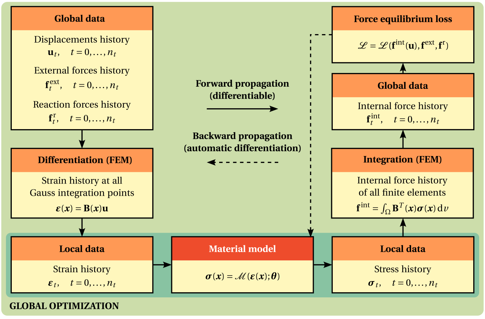
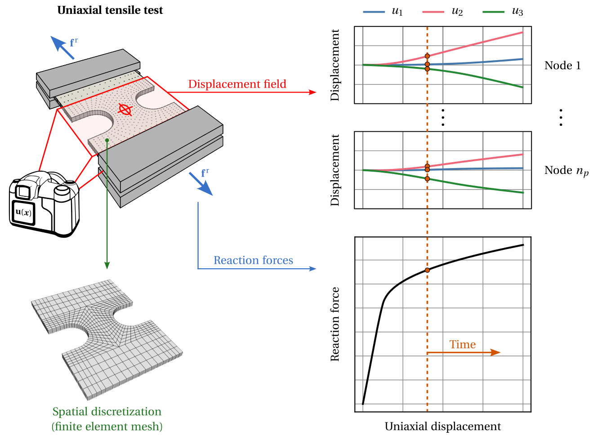

Global material model updating
==============================

One of the distinguishing functionalities of HookeAI is the ability to perform **global, indirect material model updating**. Given a **specimen's displacement-force data**, obtained from experimental tests or numerical simulations, and a given **parametric material model**, the `Automatically Differentiable Model Updating (ADiMU) <https://arxiv.org/abs/2505.07801>`_ framework is leveraged to **identify the optimal parameters** of the material model that best explain the material response observed in the data.

|

----

Key resources
-------------

.. list-table::
   :header-rows: 1
   :widths: 40 60

   * - **Source file/directory**
     - **Description**
   * - ``hookeai/material_model_finder``
     - Directory containing the core implementation of ADiMU's **global material model updating framework**, including the data handling, the material finder forward model, and the model updating procedure.
   * - ``hookeai/user_scripts/global_model_update``
     - Directory containing a set of **pre-configured user scripts** to perform global model updating.

|

----

Model updating procedures
-------------------------

Alongside the **material finder forward model** (:code:`material_discovery.py`), HookeAI provides the required modules to perform the two main procedures involved in global model updating: (i) the **specimen's data encoding procedure** (:code:`specimen_data.py`), where the relevant specimen's data is loaded and stored in suitable data structures, and (ii) the **training procedure** (:code:`training.py`), which implements the optimization loop to update the material model parameters.

The specimen's data is encoded in a dedicated class (:code:`SpecimenNumericalData`) that essentially stores **two data components**. On the one side, it stores the **specimen's discretization** in a finite element mesh, namely the nodes coordinates and elements connectivities. On the other side, it stores the **specimen's displacement-force data**, namely the full displacement field history, the reaction forces history, and the Dirichlet boundary constraints.

|

The **material finder forward model** (:code:`MaterialModelFinder`) is the core piece of the global model updating procedure. It consists of a **fully implicit, automatically differentiable finite element model** that essentially computes the specimen's internal forces history based on the provided displacement field history and the selected material model architecture. These internal forces are then assembled together with the provided reaction forces history to finally compute the **force equilibrium loss** that drives the material model updating process. The material finder model parameters are the parameters of the selected material model architecture, which can be any conventional (physics-based), neural network (data-driven), or hybrid material model, and is integrated by means of a dedicated class (:code:`StructureMaterialState`).

The training procedure is **highly customizable**, allowing the user to select different **optimization algorithms**, learning rate schedulers, **loss functions**, and other hyperparameters. It also provides a detailed logging and a set of output files that summarize the training process and results.

----

Pre-configured user scripts
---------------------------
HookeAI provides a set of **pre-configured user scripts** to perform the different global model updating procedures. These scripts can be readily used and demonstrate the typical workflow, from the **specimen's data encoding procedure** to the **discovery of the selected material model's optimal parameters**. They also include all the required pre-processing steps, such as loading the specimen's data and setting the material model architecture, and can be **easily adapted** to suit specific user needs, without the need to implement the entire workflow from scratch.