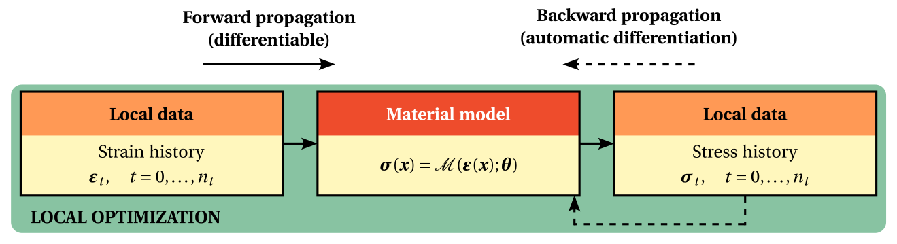
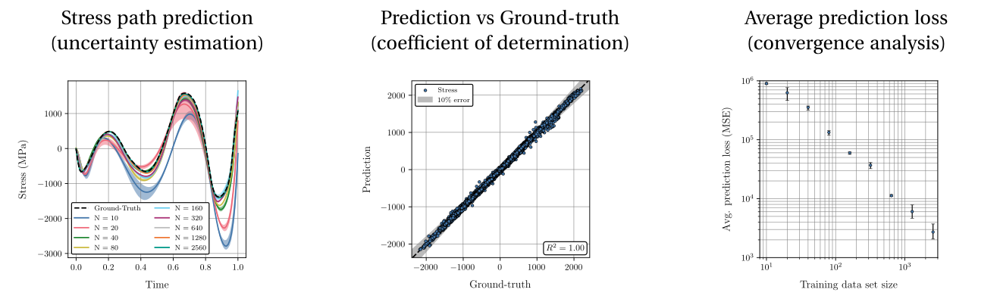

Local material model updating
=============================

One of the core functionalities of HookeAI is the ability to perform **local, direct material model updating**. Given a **data set of strain-stress paths**, often obtained from numerical simulations, and a given **parametric material model**, the `Automatically Differentiable Model Updating (ADiMU) <https://arxiv.org/abs/2505.07801>`_ framework is leveraged to **identify the optimal parameters** of the material model that best explain the material behavior observed in the data.

|

----

Key resources
-------------

.. list-table::
   :header-rows: 1
   :widths: 40 60

   * - **Source file/directory**
     - **Description**
   * - ``hookeai/model_architectures``
     - Directory containing the implementation of all **pre-built material model architectures**, as well as the associated **training** and **prediction** procedures.
   * - ``hookeai/user_scripts/local_model_update``
     - Directory containing a set of **pre-configured user scripts** to perform local model updating for the different pre-built material model architectures.

|

----

Model updating procedures
-------------------------
Alongside each **material model architecture**, HookeAI provides the corresponding modules to perform the two main procedures involved in local model updating: (i) the **training procedure** (:code:`training.py`), which implements the optimization loop to update the material model parameters, and (ii) the **prediction procedure** (:code:`prediction.py`), which enables the evaluation of the trained material model on (unseen) testing data.

The training procedure is **highly customizable**, allowing the user to select different **optimization algorithms**, learning rate schedulers, **loss functions**, and other hyperparameters. It also includes a set of useful features such as **early stopping**, based on provided validation data, and the automatic fitting of suitable **data scalers** based on the training data, which are then used to consistently normalize/denormalize the input/output features. Lastly, it provides a detailed logging and a set of output files that summarize the training process and results.

.. image:: ../../../media/schematics/hookeai_local_training.png
   :width: 100 %
   :align: center

|

The prediction procedure allows a straightforward evaluation of the material model's performance on any given data set. The input/output features are automatically normalized/denormalized using the model's fitted data scalers, ensuring consistency between training and testing phases, and **batch processing** is supported to efficiently predict on large data sets. Sample **prediction files** are generated with relevant results, including the corresponding prediction loss when the ground truth data is provided. Lastly, it also provides a detailed logging of the prediction process and an output file sumarizing the prediction parameters and results.

|

----

Pre-configured user scripts
---------------------------
HookeAI provides a set of **pre-configured user scripts** to perform the local model updating procedures for the different pre-built material model architectures. These scripts can be readily used and demonstrate the typical workflow for **training and evaluating each material model**, including all pre- and post-processing steps such as setting the model architecture, loading the data sets, computing the input/output features, configuring the training/prediction parameters, computing performance metrics, and generating prediction plots. These can also be **easily adapted** to suit specific user needs, without the need to implement the entire workflow from scratch.
