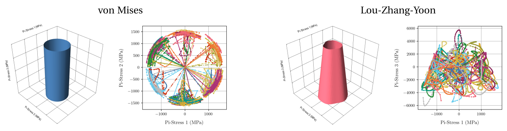
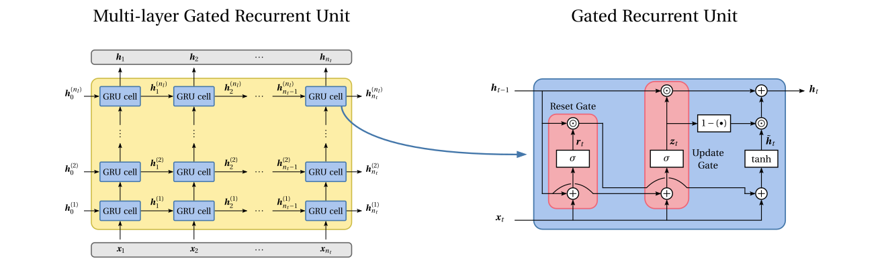
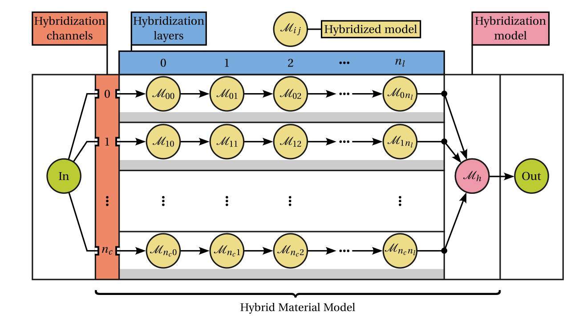

Material model architectures
============================

Material models are at the very core of the `Automatically Differentiable Model Updating (ADiMU) <https://doi.org/10.1016/j.jmps.2025.106408>`_ framework. Despite handling **any type of parametric material model**, HookeAI includes a variety of **pre-built** **conventional** (physics-based), **neural network** (data-driven), and **hybrid** material models.

.. note ::

    At the moment, HookeAI **does not** provide a formal interface to implement material model architectures. Nonetheless, all the pre-built models provide clear blueprints to implement and integrate custom architectures.

----

Key resources
-------------

.. list-table::
   :header-rows: 1
   :widths: 40 60

   * - **Source file/directory**
     - **Description**
   * - ``hookeai/model_architectures``
     - Directory containing the implementation of all **pre-built material model architectures**, as well as the associated **training** and **prediction** procedures.
   * - ``hookeai/simulators/fetorch/material``
     - Directory containing the implementation of **conventional material models** from the **FETorch** (PyTorch-based Finite Element Method) library.

|

----

Conventional material models
----------------------------

**Conventional** (physics-based, mechanistic or phenomenological) material models are formulated based on rigorous **physics-based theoretical frameworks**, ensuring thermodynamical consistency and fundamental principles like frame invariance and material objectivity. They typically involve a limited number of parameters, often linked to measurable physical quantities, and comprise a **set of well-defined constitutive equations** to describe different types of material behavior (e.g., elasticity, plasticity, viscoelasticity, damage).

Instead of demanding tailored implementations to fit within the ADiMU framework, HookeAI provides a **single, pre-built model architecture** (:code:`RecurrentConstitutiveModel`) that wraps the standard implementation of conventional material models. This **wrapper** handles all the required procedures for material model updating, such as parameter normalization/denormalization, enforcement of parameters constraints, and batch processing of features data. Several conventional material models from the **FETorch material library** (:code:`ConstitutiveModel`) are already integrated within this architecture, including: (i) Linear elasticity (:code:`Elastic`), (ii) von Mises elastoplasticity with isotropic and kinematic hardening (:code:`VonMises`, :code:`VonMisesVMAP`, :code:`VonMisesMixed`, :code:`VonMisesMixedVMAP`), (iii) Drucker-Prager elastoplasticity (:code:`DruckerPrager`, :code:`DruckerPragerVMAP`), and (iv) Lou-Zhang-Yoon elastoplasticity (:code:`LouZhangYoon`, :code:`LouZhangYoonVMAP`).

.. warning ::

    In order to enable an efficient updating process, HookeAI's material model updating leverages `PyTorch's vectorizing maps <https://docs.pytorch.org/docs/stable/generated/torch.vmap.html>`_. This requires that the conventional material model's implementation is compatible with **PyTorch vectorization requirements**. Both **standard** and **VMAP-compatible** versions of each conventional material model are provided in the FETorch material library.

----

Neural network material models
------------------------------

**Neural network** (data-driven) material models leverage the powerful function approximation capabilities of **deep neural networks** to learn the material behavior directly from data. Deep learning architectures that integrate appropriate activation functions, inductive biases (e.g., invariances, symmetries) and recurrent structures can effectively capture complex, nonlinear history-dependent material responses without relying on explicit constitutive equations. However, given that these models lack a physics-based foundation and often span tens to billions of non-physically interpretable parameters, they typically **require large amounts of high-quality, representative data** to deliver accurate predictions and generalize well to unseen scenarios.

HookeAI provides a **pre-built neural network material model** that consists of a multi-layer gated recurrent unit (GRU) architecture (:code:`GRURNNModel`). The model is particularly well-suited to capture **history-dependent material behavior**, as it can process time series data and effectively learn material behavior temporal dependencies. The model can handle input/output features of arbitrary dimensionality beyond the required strain and stress tensors, such as strain-based (:code:`strain_features.dat`) and stress-based (e.g., :code:`stress_features.dat`) additional features (e.g., invariants, volumetric/deviatoric components) as well as other features to capture relevant material behavior dependencies (e.g., temperature, strain rate, composition).

.. note ::

    While the low-level GRU architecture is imported from `PyTorch <https://pytorch.org/docs/stable/generated/torch.nn.GRU.html>`_ by default, HookeAI also provides a **fully custom implementation** of the same architecture (:code:`GRU`). Despite being less computationally efficient, this custom implementation is compatible with PyTorch's vectorization requirements.

----

Hybrid material models
----------------------

**Hybrid** material models **integrate physics-based and data-driven components** within a unified framework. Irrespective of the specific architecture, the objective is to combine the advantages of both paradigms: the thermodynamic consistency, robustness, and interpretability of conventional models, together with the flexibility and high expressiveness of neural networks models. Such models may embed neural networks within established constitutive formulations to capture complex behaviors, enforce thermodynamical constraints directly on neural network architectures, and/or integrate multiple models in sequential or parallel configurations. Consequently, hybrid architectures pave the way for a new generation of material models, where physical principles and data-driven representations can be systematically integrated to capture increasingly complex behaviors.

HookeAI provides a **highly customizable pre-built hybrid material model** (:code:`HybridModel`) that enables the combination of any conventional and neural network models, each integrated as a hybridized model with a corresponding set of parameters, in a graph-like structure of hybridization channels and layers. The outputs of the different hybridization channels are then collected by a hybridization model (:code:`HybridizationModel`), itself a general parametric model, that yields the resulting material stress prediction. This flexible architecture allows the implementation of endless hybrid model architectures that can handle input/output features of arbitrary dimensionality and include general non-parametric layers as well.

