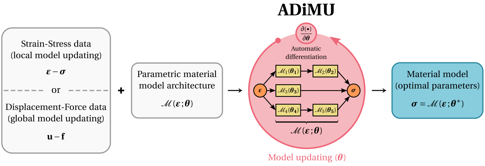

Overview
========

A quick overview over HookeAI's conceptual and computational frameworks.

----

Conceptual framework
--------------------

HookeAI's conceptual framework lies at the intersection of **computational mechanics**, **machine learning** and **scientific computing**. In particular, it is centered around the `Automatically Differentiable Model Updating (ADiMU) <https://arxiv.org/abs/2505.07801>`_ framework, a unified approach for material model updating in computational solid mechanics. Accurate material models are crucial for the design and analysis of engineering systems, as they directly impact the reliability of numerical simulations.

A **material model** is a mathematical representation of the constitutive behavior of a material, establishing a relationship between strain and stress that, in the general case, is nonlinear and history-dependent. These models must be expressive enough to capture the material behavior and are typically parametrized by a **set of parameters** that need to be found from **available data**. The process of determining the optimal set of parameters that best explain the material behavior from available data is known as **model updating**.

HookeAI supports any type of parametric material model, including: (i) **conventional (physics-based) models** (e.g., von Mises, Drucker-Prager), (ii) **neural network (data-driven) models** (e.g., Input Convex Neural Networks, Recurrent Neural Networks), and (iii) **hybrid models** that combine both physics-based and data-driven components. Moreover, HookeAI can perform model updating from different data sources. On the one hand, it enables the **local, direct model updating** from **strain-stress data**, often obtained from numerical simulations. On the other hand, it supports the **global, indirect model updating** from **displacement-force data**, which is typically available from experimental tests.

|

Beyond the core ADiMU framework, HookeAI includes numerous computational resources to support AI-enhanced material modeling research. Among these are **data analysis and generation methods**, **feature engineering** tools, ready-to-use **model training-validation-testing** pipelines, **hyperparameter optimization** processes, **data visualization** utilities, prediction **performance metrics**, and much more.

----

Computational framework
-----------------------

HookeAI is developed entirely in **Python** using an object-oriented design. Its core, the `Automatically Differentiable Model Updating (ADiMU) <https://arxiv.org/abs/2505.07801>`_ framework, is built on **PyTorch**, leveraging automatic differentiation, vectorized operations, and GPU acceleration. The software also integrates widely used scientific libraries such as **NumPy**, **SciPy**, and **Scikit-learn**, as well as **Pandas** and **Matplotlib** for data analysis and visualization.

Moreover, HookeAI was developed with a strong emphasis on **code readability, maintainability, and extensibility**. Consistent naming conventions, thorough documentation, and demonstrative user scripts facilitate understanding of both functionality and implementation. A modular architecture, based on well-structured classes, functions and interfaces, ensures that HookeAI can be readily extended and customized for diverse user needs.

.. image:: ../../../media/schematics/hookeai_packages.png
   :width: 90 %
   :align: center

|